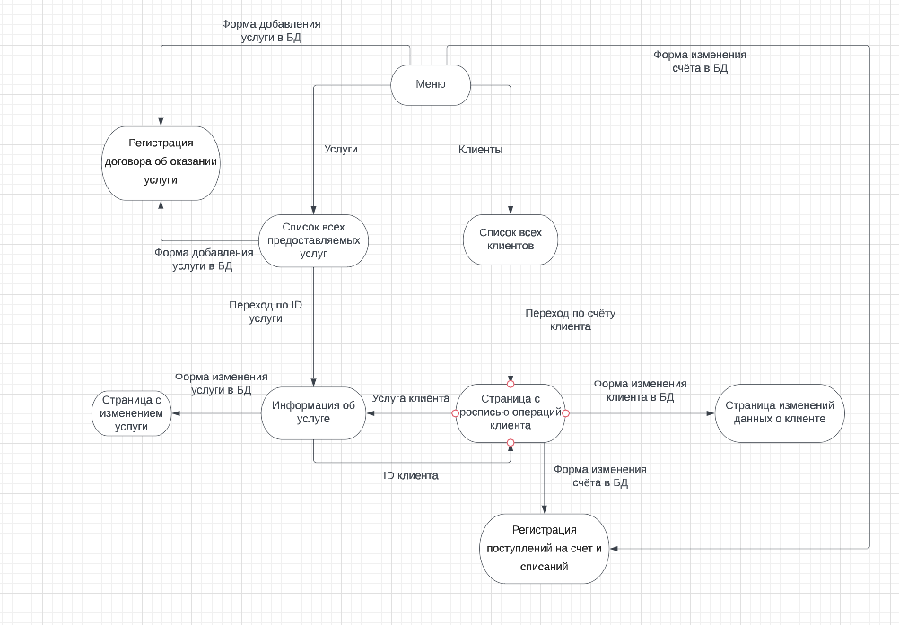

# Описание страниц

На любой странице есть специальная кнопка, возвращающая на главную страницу.

#### Главная страница
ссылка на список всех предоставляемых услуг
ссылка на список всех клиенов
форма добавления услуги, перенаправляющая на страницу регистрации договора об оказании услуги
форма изменения счёта по ID, перенаправляющая на страницу регистрации поступлений на счет и списаний

#### Список всех предоставляемых услуг
список всех услуг, которые предоставляет компания
форма добавления услуги, перенаправляющая на страницу регистрации договора об оказании услуги
переход на информацию об услуге с дополнителной информацией

#### Информация об услуге
форма изменения услуги, перенаправляющая на страницу с изменением услуги
ссылка на страницу с росписью операций клийента по ID клиента

#### Список всех клиентов
список всех клиентов в базе
переход на страницу с росписью операций клиента

#### Страница с росписью операций клиента
информация об операциях и об услугах клиента 
переход на информацию об услуге
форма изменения счёта, перенаправляющая на страницу регистрации поступлений на счет и списаний
форма изменений данных о клиенте

# Сценарии использования

#### Получения информации об предоставляемых услугах
перейти на главную страницу
перейти на страницу всех предоставляемых услуг
возможно использовать фильтрацию 

#### Изменение данных о клиенте
перейти на главную страницу
перейти на список всех клиентов
найти по ID нужного клиента и перейти на страницу с его данными
использовать форму изменений данных

#### Регистрация поступлений на счёт и списаний
перейти на главную страницу
использовать форму регистрации поступлений

#### Удаление услуги
перейти на главную страницу
перейти на список всех услуг
найти нужную услугу по названию или по ID
использовать форму изменений услуги для её удаления

